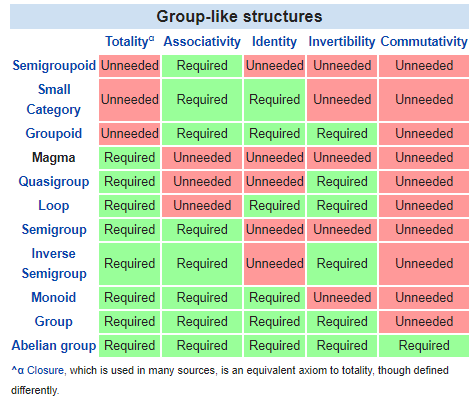

Assumptions on spaces and structures
====================================

**Created:**

_10/4/2019 3:02 PM_

**Updated:**

_10/4/2019 3:44 PM_

**Author:**

_Bogdan Bocse_

  

The assumption of idempotence-over-time.
The assumption of immutability-over-time.
Spatio-temporal (i.e. physical) custody.
Assumptions on reasonable durability.
Durability: Statefulness and statelessness.

  

  

  

